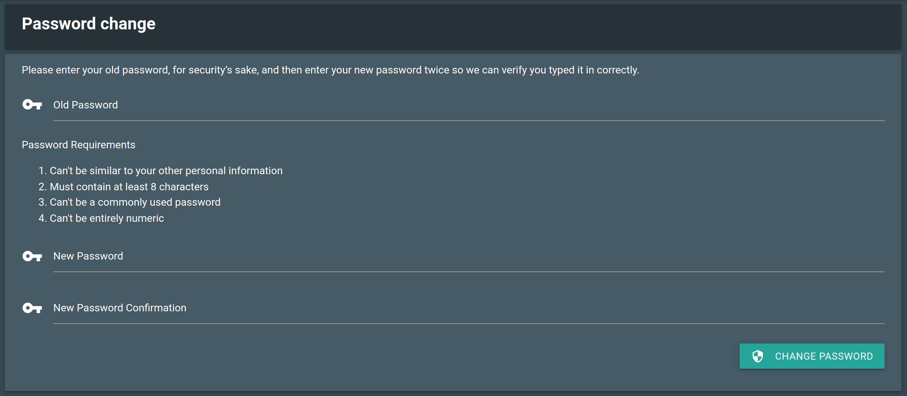

Getting Access
##############

.. warning::
   We allow everyone to have an account. Please don't share your credentials with anyone.

Any astronomer with an observing proposal can have access. Principal
Investigators (PIs) can also create users to be added as collaborators to their
respective proposals.

The server is protected under a VPN connection that you can get from your
Instrument Scientist or by any trusted contact you have at SOAR Telescope.

At the beginning of the semester all PIs are registered with their respective
proposals. And they will receive an email that contains a link to set a safe
password. Our backend does not allow simple or too common password. In fact you
will get the following messages.

    - Your password can’t be too similar to your other personal information.
    - Your password must contain at least 8 characters.
    - Your password can’t be a commonly used password.
    - Your password can’t be entirely numeric.

