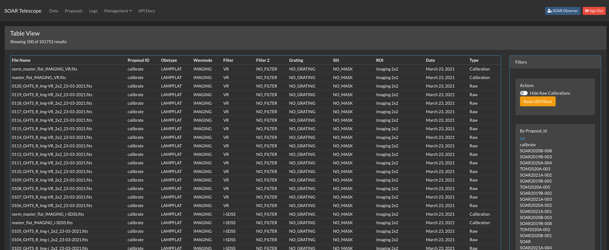
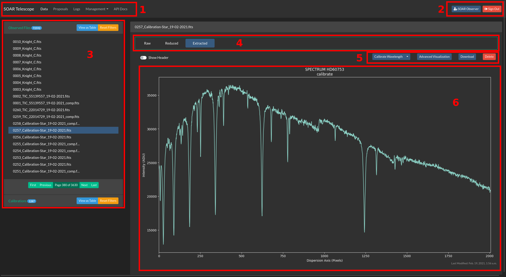
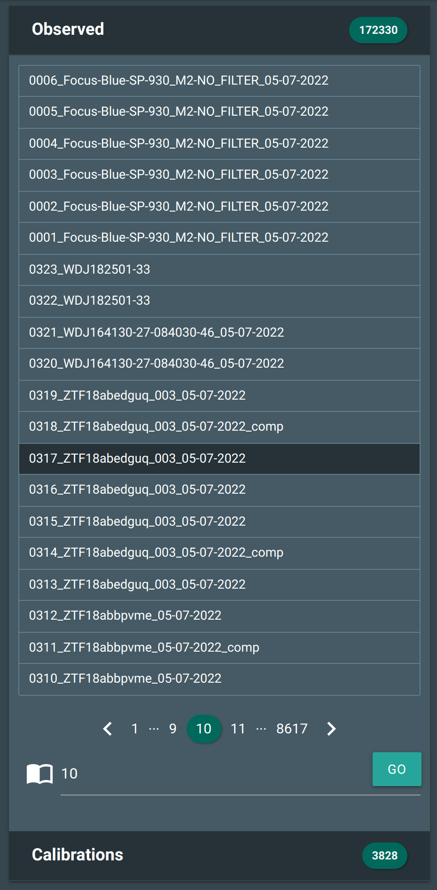
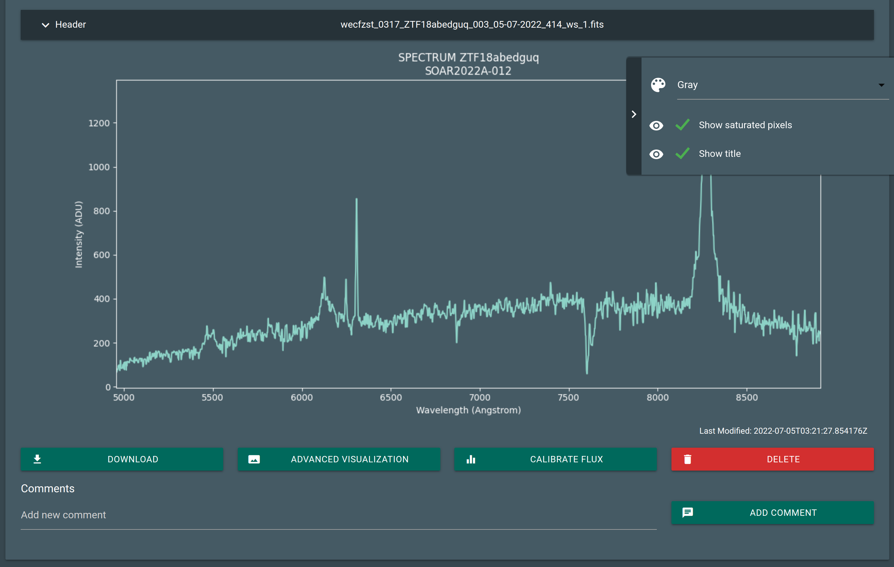

Data Visualization
##################

One of the greatest benefits from having a web user interface (UI) is the great
flexibility it provides without having to install any special software and the
data is downloaded through channels we use in our everyday life.

Understanding the UI
********************

We will go into details later but for now this is what you see most of the time.
It is meant to be simple to understand but we will go into explaining every part.

.. figure:: _static/screenshots/data_detail.png

   Data detailed view.

   Table view, better for filtering data.

For a detailed exploration we will divide the view in several subsections, for
their global position please consider the following image.

   Detail: 1. Main navigation bar. 2. Access to user controls and information. 3. Quick access to files. 4. Related or child files. 5. Contextual actions 6. Visualization area.

Main Navigation Bar
===================

User Controls
=============

File Index
==========

Related Files
=============

Contextual Actions
==================

Visualization Area
==================

