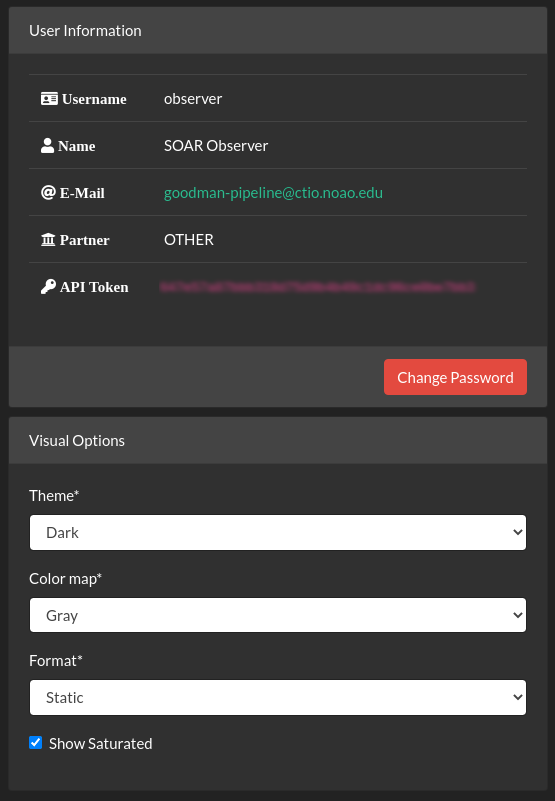

Data Visualization
##################

One of the greatest benefits from having a web user interface (UI) is the great
flexibility it provides without having to install any special software and the
data is downloaded through channels we use in our everyday life.

Understanding the UI
********************

We will go into details later but for now this is what you see most of the time.
It is meant to be simple to understand but we will go into explaining every part.

.. figure:: _static/screenshots/data_detail.png

   Data detailed view.

.. figure:: _static/screenshots/data_table.png

   Table view, better for filtering data.

For a detailed exploration we will divide the view in several subsections, for
their global position please consider the following image.

.. figure:: _static/screenshots/data_detail_annotated.png

   Detail: 1. Main navigation bar. 2. Access to user controls and information. 3. Quick access to files. 4. Related or child files. 5. Contextual actions 6. Visualization area.

Main Navigation Bar
===================

.. figure:: _static/screenshots/navigation_bar.png

An always present navigation bar allows you to access:

Data Visualization
  The view were you can visualize data as it arrives as well as trigger actions.

Proposals
   Where you can see the proposals details, such as *Title*, *Abstract*,
   *Principal Investigator* and *Collaborators*. Also you can add or delete
   collaborators and edit the *Data Reduction Settings*.

Logs
  Important log messages, not very detailed but the most relevants.

Management Menu
  This is for staff users only and will be explained in the staff chapter.

API Docs
  Contains the documentation of the Public API in case you want to
  develop your own tools.

User Controls
=============

.. figure:: _static/screenshots/user_controls.png

By clicking the blue button you get access to some user details and settings.
Also you can change some preferences.

File Index
==========

This area allows you to navigate the files, they are ordered from newest to
oldest, if you want to filter the data you should go to table mode by clicking
**View as Table**.

In this area you can also see only combined calibration files such as, master ``BIAS`` and master ``FLAT``, those
are visible to everyone.

.. figure:: _static/screenshots/file_index.png

Related Files
=============

.. figure:: _static/screenshots/related_files.png

All files are indexed by its raw parent file. Every file that was derived from
that parent it is treated as child and are listed along this section. The
buttons are tab handles.

Contextual Actions
==================

.. figure:: _static/screenshots/contextual_actions.png

This area is where you can trigger actions.

Show Header
  Will make the header visible in a searchable table.

Calibrate Wavelength
  It's an action that changes according the type of file that is no display.
  For instance for a raw file will be **Reduce Raw File**. The drop down menu
  will take you to another view where you can select which comparison lamp you
  want to use for target extraction or wavelength calibration.

Advanced Visualization
  Takes you to another view where you can adjust the sampling limits for
  images. Or change the color map.

Download
  For download the FITS file.

Delete
  Only possible for processed files. Raw files can't be deleted.

Visualization Area
==================

.. figure:: _static/screenshots/visualization_area.png

   Example of a static data visualization.

In this area you see the plots or the images. There is an interactive way that
uses `Bokeh <https://docs.bokeh.org/en/latest/index.html>`_ but is slower. and
for now it only allows you to zoom in or out.