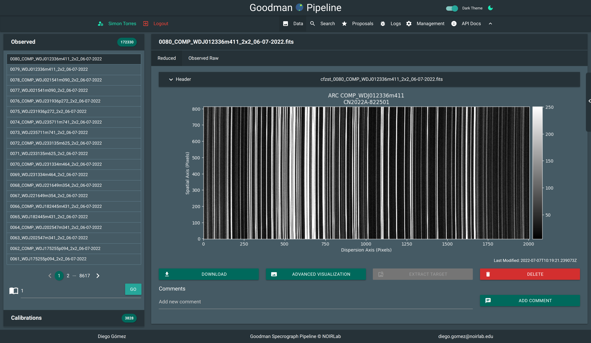

.. User Manual documentation master file, created by
   sphinx-quickstart on Mon Mar 15 15:59:05 2021.
   You can adapt this file completely to your liking, but it should at least
   contain the root `toctree` directive.

Welcome to Live Pipeline User Manual
====================================

The Goodman Spectroscopic Pipeline Live is a web implementation of the
`Goodman Spectroscopic Pipeline <https://github.com/soar-telescope/goodman_pipeline>`_ package.
In summary the reduction process has been broken in several parts that might
include more than one step of the full process. Each of these parts has a
correspondent web API end point.

All this is nicely presented to the user as a web page where the user can
visualize fully reduced spectra just seconds after it was obtained. Also the user
has the option of manually triggering certain process blocks.

.. note::
  The user get access permission by proposal association. We ask our users not to
  share their credentials. We make it very easy for PIs to add new collaborators.

.. toctree::
   :maxdepth: 2
   :caption: User Manual:

   overview
   access
   datadetail
   settings
   collaborators
   API Documentation <user_api_docs>
   screenshots

.. toctree::
   :maxdepth: 2
   :caption: Staff Users Manual:

   Adding Users <staff_adding_users>
   Adding Proposals <staff_adding_proposals>

.. toctree::
   :maxdepth: 2
   :caption: Developer's Guide:

   API Overview <api_overview>
   Examples <api_examples>