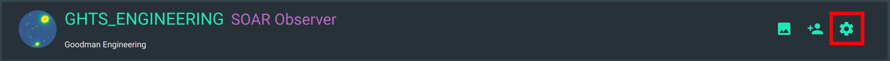

.. role:: raw-html(raw)
    :format: html

Data Reduction Settings
#######################

In your navigation bar click in **Proposals** then the cogs icon.

Now you can change the settings that will be used for this particular proposal
in all reduction steps and in every new file.

.. figure:: _static/screenshots/proposal_data_red_settings.png