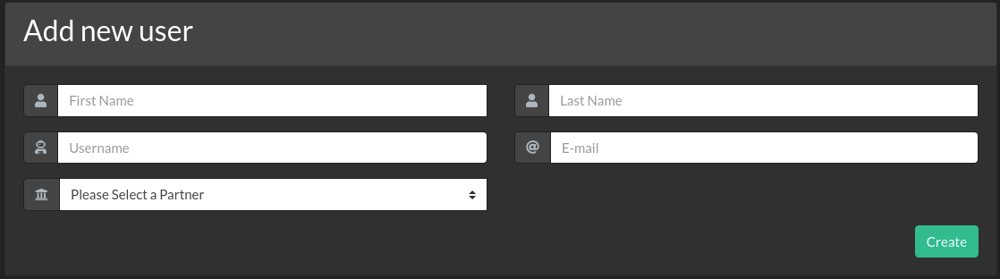

.. role:: raw-html(raw)
    :format: html

.. _adding-new-users:

Adding new Users
################

.. warning::
   This section is meant for **staff** users only

There are several ways you can access the user creation form. The faster would be:

**Management** :raw-html:`&rarr;` **Add User**

Another way that will take you to the same form is:

**Management** :raw-html:`&rarr;` **Manage Users** :raw-html:`&rarr;` click **Add new**

   Add new user form

.. note::
   Staff users can only be added from a super user account for now.

And the last one would be through Proposals's :ref:`Collaborators`

