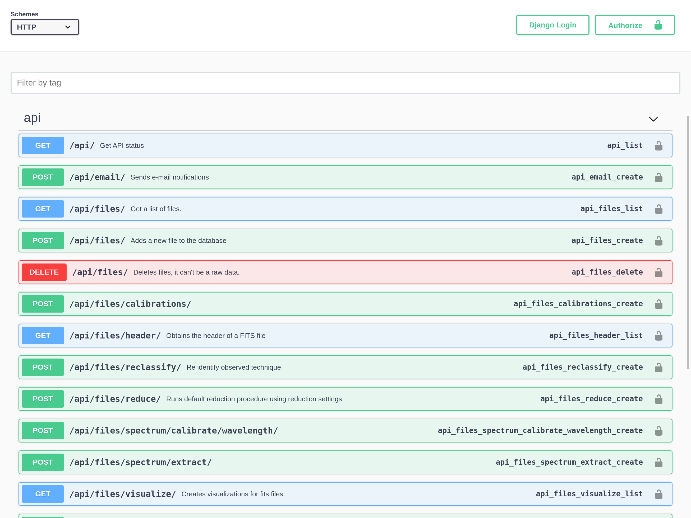

API Documentation
#################

More on this can be found on :ref:`Developer's Guide<API Overview>` chapter.
You can get here from clicking **API Docs** in the navigation bar.

In this section you can even try the API if you are authenticated.

   Public API documentation.